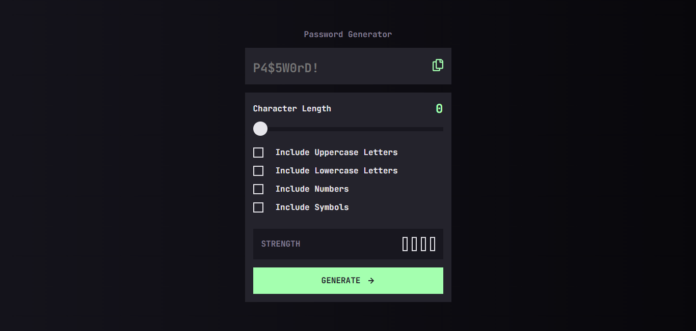

# Frontend Mentor - Password generator app solution

This is a solution to the [Password generator app challenge on Frontend Mentor](https://www.frontendmentor.io/challenges/password-generator-app-Mr8CLycqjh). Frontend Mentor challenges help you improve your coding skills by building realistic projects.

## Table of contents

- [Overview](#overview)
  - [The challenge](#the-challenge)
  - [Screenshot](#screenshot)
  - [Links](#links)
- [My process](#my-process)
  - [Built with](#built-with)
  - [What I learned](#what-i-learned)
  - [Useful resources](#useful-resources)
- [Author](#author)

## Overview

### The challenge

Users should be able to:

- Generate a password based on the selected inclusion options
- Copy the generated password to the computer's clipboard
- See a strength rating for their generated password
- View the optimal layout for the interface depending on their device's screen size
- See hover and focus states for all interactive elements on the page

### Screenshot

### Links

- Solution URL: [Frontend Mentor Solution](https://www.frontendmentor.io/solutions/password-generator-app-yK6rWvap-C)
- Live Site URL: [Password Generator](https://gustavo2023.github.io/password-generator-app/)

## My process

### Built with

- Semantic HTML5 markup
- CSS custom properties
- Flexbox
- Mobile-first workflow
- JavaScript

### What I learned

- **Custom Range Input Styling:** Learned to style HTML range inputs (`<input type="range">`) across different browsers using pseudo-elements like `::-webkit-slider-thumb` and `::-moz-range-thumb`. Implemented a dynamic track fill effect by overlaying a `div` (`.range-color-display`) and updating its width based on the slider's value using JavaScript.
- **Character Set Generation:** Utilized JavaScript's `String.fromCharCode()` method in combination with ASCII character codes to programmatically generate arrays of characters (lowercase, uppercase, numbers, symbols) needed for the password pool.
- **Fisher-Yates (Knuth) Shuffle:** Implemented the Fisher-Yates algorithm to efficiently and uniformly shuffle the array of characters, ensuring a more random distribution in the final generated password. This was crucial for mixing the guaranteed character types with the randomly selected ones.
- **Password Strength Algorithm:** Developed a custom algorithm to assess password strength based on multiple criteria: password length and the variety of character types included (uppercase, lowercase, numbers, symbols). Assigned a numerical score based on these factors.
- **Object-Based UI Updates:** Used a JavaScript object (`strengthLevelsInfo`) as a configuration map within the `updateStrengthIndicators` function. This provided a clean way to associate strength levels (0-4) with corresponding display text (`"WEAK"`, `"STRONG"`, etc.) and CSS classes (`"weak"`, `"strong"`, etc.), simplifying the logic for updating the strength indicator text and styling the visual bars. Dynamically removing old classes before adding new ones ensured correct state representation.

### Useful resources

- [Shuffle a given array using Fisher–Yates shuffle Algorithm](https://www.geeksforgeeks.org/shuffle-a-given-array-using-fisher-yates-shuffle-algorithm/) - This article helped me understand the Fisher-Yates algorithm to shuffle an array.

## Author

- Frontend Mentor - [@gustavo2023](https://www.frontendmentor.io/profile/gustavo2023)
